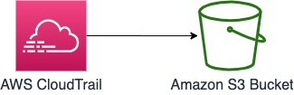
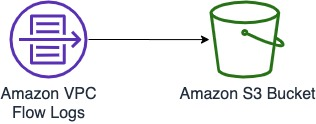
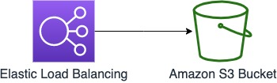
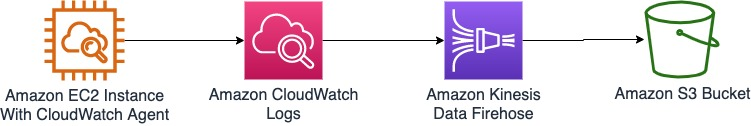
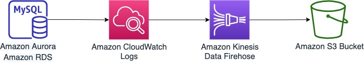

## ログの収集
### AWS CloudTrail



* 管理イベント
* データイベント

### AWS Config


* Configuration 履歴
* Configuration スナップショット

### Amazon VPC Flow Logs



### Elastic Load Balancing (ELB)




### EC2 インスタンス (Amazon Linux 2/2023)



* OS のシステムログ
  * s3_key の初期値: `/[Ll]inux/` (Firehose の出力パスに指定)
* Secure ログ
  * s3_key の初期値: `[Ll]inux.?[Ss]ecure` (Firehose の出力パスに指定)

### RDS (Aurora MySQL互換 / MySQL / MariaDB)



* 監査ログ (Audit log)
* エラーログ (Error log)
* 一般ログ (General log)
* スロークエリログ (Slow query log)


## 準備
以下のコマンドを実行してS3バケットを作成しておく。

```
account_id=$(aws sts get-caller-identity --query Account --output text)
aws s3api create-bucket \
    --bucket "terraform-state-${account_id}" \
    --region ap-northeast-1 \
    --create-bucket-configuration LocationConstraint=ap-northeast-1
```
