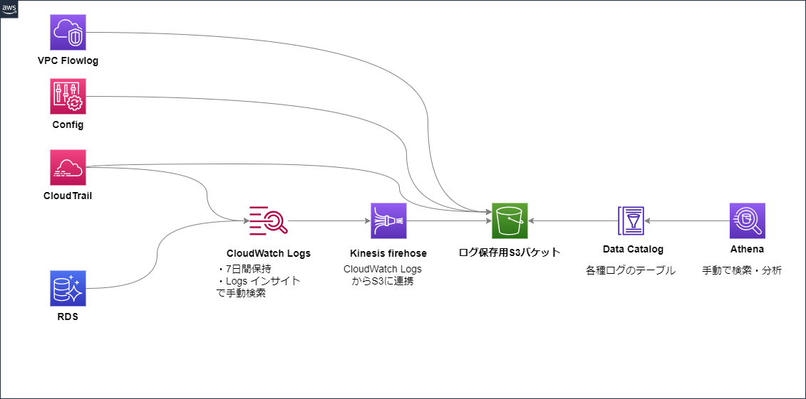
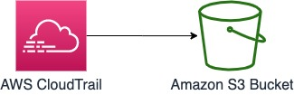
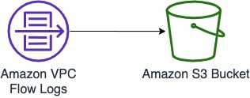
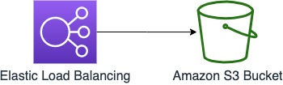
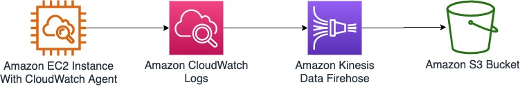
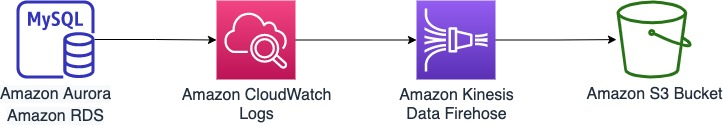

### 全体像



## 収集
### AWS CloudTrail



* 管理イベント
* データイベント

### AWS Config


* Configuration 履歴
* Configuration スナップショット

### Amazon VPC Flow Logs



### Elastic Load Balancing (ELB)




### EC2 インスタンス (Amazon Linux 2/2023)



* OS のシステムログ
  * s3_key の初期値: `/[Ll]inux/` (Firehose の出力パスに指定)
* Secure ログ
  * s3_key の初期値: `[Ll]inux.?[Ss]ecure` (Firehose の出力パスに指定)

### RDS (Aurora MySQL互換 / MySQL / MariaDB)



* 監査ログ (Audit log)
* エラーログ (Error log)
* 一般ログ (General log)
* スロークエリログ (Slow query log)


## 利用方法

1. AWSの環境変数を設定する
```
export AWS_ACCESS_KEY_ID=<your_access_key_id> && \
export AWS_SECRET_ACCESS_KEY=<your_secret_key> && \
export AWS_SESSION_TOKEN=<your_session_token> && \
export AWS_DEFAULT_REGION=ap-northeast-1
```

2. Terraform適用
```
docker compose run --rm terraform init
docker compose run --rm terraform plan
docker compose run --rm terraform apply
docker compose run --rm terraform destroy
```

* Note: docker compose runのオプション
  * docker-compose run [オプション] [-v ボリューム...] [-p ポート...] [-e KEY=VAL...] [-l KEY=VALUE...]
      サービス [コマンド] [引数...]
  * --rm                  コンテナ実行後に削除。デタッチド・モードの場合は無視
